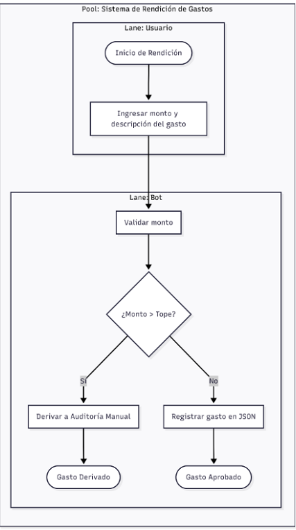
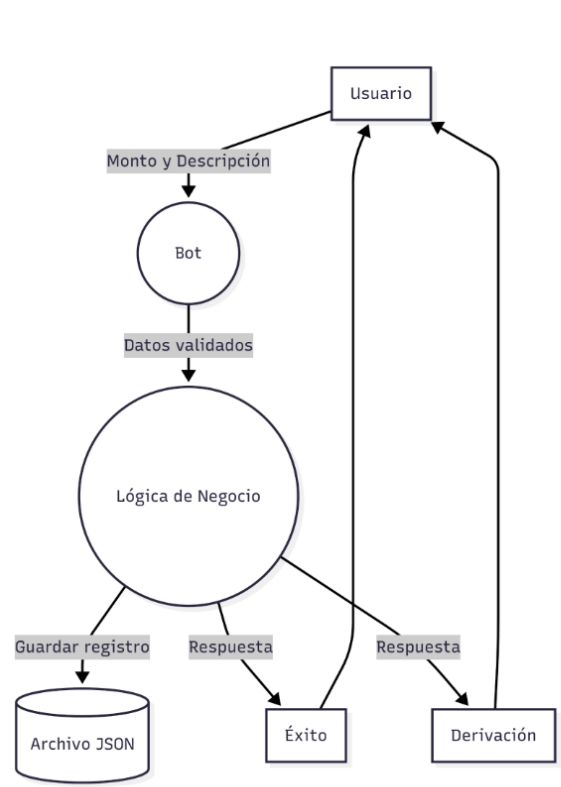
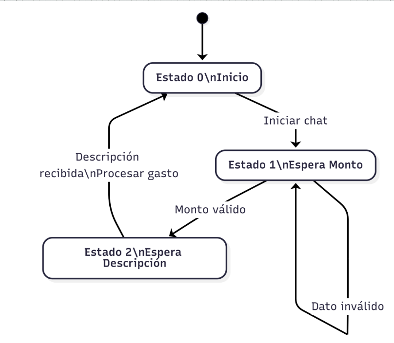

# Sistema de Rendición de Gastos

## Integrante

- Valentina Fernández Basualdo

---

## Descripción del Proyecto

Este proyecto consiste en el desarrollo de un bot de rendición de gastos realizado en Python.

El sistema permite que un usuario registre un gasto ingresando un monto y una descripción. Posteriormente, el sistema valida la información y aplica una regla de negocio:

- Si el monto es menor o igual al tope establecido, el gasto se aprueba y se registra en un archivo JSON.
- Si el monto supera el tope establecido, el gasto se deriva a Auditoría Manual.

El proyecto fue desarrollado aplicando conceptos de modelado de procesos, diagramas BPMN, máquina de estados y flujo de datos.

---

## Modelado y Análisis del Sistema






---

## Estructura del Proyecto

### bot.py

Gestiona la interacción con el usuario.

Funciones principales:

- Solicitud del monto.
- Validación del monto ingresado.
- Solicitud de la descripción.
- Manejo de estados de conversación.
- Comunicación con la lógica de negocio.

### logica.py

Implementa las reglas de negocio.

Funciones principales:

- Validación del monto contra el tope máximo.
- Registro de gastos.
- Persistencia de datos en archivo JSON.
- Manejo de excepciones.

### datos_gastos.json

Archivo donde se almacenan los gastos procesados por el sistema.

---

## Máquina de Estados

El bot implementa una máquina de estados simple:

### Estado 0
Inicio de conversación.

### Estado 1
Espera ingreso del monto.

### Estado 2
Espera ingreso de la descripción.

Luego de procesar el gasto, el sistema vuelve al Estado 0.

---

## Regla de Negocio

Se definió un tope máximo de:

```python
tope_maximo = 5000
```

### Decisión

- Monto ≤ 5000 → Gasto Aprobado.
- Monto > 5000 → Derivación a Auditoría Manual.

---

## Manejo de Errores

El sistema contempla distintos escenarios de error:

- Monto vacío.
- Monto no numérico.
- Monto negativo.
- Descripción vacía.
- Error de lectura o escritura del archivo JSON.
- Errores inesperados durante la ejecución.

---

## Tecnologías Utilizadas

- Python 3
- JSON
- Git
- GitHub

---

## Ejecución

Abrir una terminal dentro del proyecto y ejecutar:

```bash
python bot.py
```

Luego seguir las instrucciones que aparecen en pantalla.

---

## Ejemplo de Registro

### Gasto aprobado

```json
{
    "monto": 3500,
    "descripcion": "Compra de insumos",
    "estado": "Aprobado"
}
```

### Gasto derivado

```json
{
    "monto": 7000,
    "descripcion": "Compra de equipamiento",
    "estado": "Derivado a Auditoría"
}
```

---

## Diagramas Utilizados

Durante el análisis y diseño del sistema se desarrollaron los siguientes modelos:

- BPMN del proceso de rendición de gastos.
- Diagrama de Estados del bot.
- Diagrama de Flujo de Datos (DFD).

Estos diagramas permitieron representar el comportamiento del sistema antes de su implementación en Python.

---

## Uso de Inteligencia Artificial

Se empleó ChatGPT como herramienta de soporte para el modelado preliminar de procesos y la generación de diagramas. Asimismo, se utilizó Gemini para la revisión y optimización de la estructura del código.


Las propuestas obtenidas fueron analizadas, adaptadas y verificadas para asegurar su coherencia con los contenidos trabajados en la materia y con la implementación realizada en Python.

---

## Repositorio

El proyecto fue desarrollado utilizando Git y GitHub para el control de versiones.
